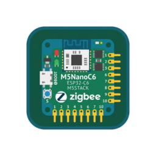
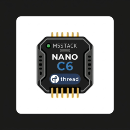

# M5Stack M5NanoC6 Zigbee 3.0 Range Extender (Router)

[](https://opensource.org/licenses/MIT)
[](https://docs.m5stack.com/en/core/M5NanoC6)
[-blue.svg)](https://www.espressif.com/en/products/socs/esp32-c6)
[](https://csa-iot.org/all-solutions/zigbee/)
[](https://github.com/espressif/arduino-esp32)
[](./firmware/)

<p align="center">
  
  &nbsp;&nbsp;&nbsp;&nbsp;&nbsp;&nbsp;&nbsp;&nbsp;
  
</p>

Open-source firmware turning the ultra-compact **M5Stack M5NanoC6** (ESP32-C6FH4) development board into a high-performance **Zigbee 3.0 Range Extender (Router)**.

Ideal for expanding Zigbee mesh coverage across your smart home, bridging dead zones, and improving link reliability for Zigbee coordinators like Home Assistant (ZHA) and Zigbee2MQTT.

---

## ✨ Features

- 🌐 **True Zigbee 3.0 Router (Range Extender):** Routes mesh traffic at the IEEE 802.15.4 layer and supports up to 20 direct child end devices.
- 💡 **Dual LED State Machine:** Seamless coordination between the onboard Blue LED and WS2812 RGB LED for clear status feedback:
  - **Searching/Pairing:** Flashing blue every 1s (500ms ON / 500ms OFF).
  - **Connected:** Solid blue for 2s, followed by solid green for 3s, then fully off.
  - **Discrete Normal Operation:** LEDs remain completely OFF during routing operation to eliminate annoying ambient light in bedrooms or living areas.
- 💓 **Active ZCL Heartbeat for Zigbee2MQTT:** Automatically transmits a periodic `genBasic` cluster read request every 60s to ensure `last_seen` and `linkquality` (LQI) stay continuously updated in Zigbee2MQTT and Home Assistant.
- 🔘 **Multi-Function Button (GPIO 9):**
  - **Quick Click (< 1s):** Instantly forces a ZCL heartbeat and ZDO query to coordinator `0x0000` with a rapid green confirmation pulse.
  - **Long Press (5s):** Clears Zigbee NVRAM/NVS credentials, leaves the current network, and reboots in pairing mode.
- 🔌 **Mains Powered Classification:** Declares `Power Source = Mains` to ensure coordinators maintain permanent keep-alive and routing paths.
- 🧩 **Zigbee2MQTT External Converter Included:** Ready-to-use converter (`m5nanoc6_extender.js`) for full vendor, model, and device identification in Z2M.

---

## 📌 Hardware Pinout (M5NanoC6)

| Pin | Function | Configuration | Description |
| :--- | :--- | :--- | :--- |
| **GPIO 9** | Front Button | `INPUT_PULLUP` | Active-low user input (Quick Click = Ping, 5s = Factory Reset) |
| **GPIO 7** | Blue LED | `OUTPUT` | Built-in monochrome blue LED |
| **GPIO 19** | RGB LED Power Switch | `OUTPUT` | Power gate for WS2812 (set `HIGH` to enable) |
| **GPIO 20** | RGB LED Data | `rgbLedWrite()` | WS2812 addressable RGB LED data signal |
| **USB CDC** | Serial Monitor & Upload | 115200 bps | Native USB-Serial/JTAG port |

---

## 🚦 LED Status Indicators

| State | Pattern | Details |
| :--- | :--- | :--- |
| **Pairing / Searching** | 🔵 Blinking Blue (1s period) | Device looking for an open Zigbee network. |
| **Connected (Stage 1)** | 🔵 Solid Blue for 2s | Successfully joined Zigbee network. |
| **Connected (Stage 2)** | 🟢 Solid Green for 3s | Network connection confirmed. |
| **Operational Mode** | ⚫ Off | Silent mesh routing active; no ambient light disturbance. |
| **Communication Test** | 🟢 Rapid Green Pulse (250ms) | Triggered by 1x quick button click. |
| **Factory Reset** | 🔴 Solid Red for 1s | Triggered after holding button for 5s before reboot. |

---

## 📡 Zigbee2MQTT Integration

### Why do Zigbee Routers sometimes freeze `last_seen` or `linkquality`?
When a router merely repeats packets from child sensors, the source address in the payload belongs to the original sensor. Without periodic application-level messages originating from the router itself, Zigbee2MQTT won't receive incoming frames to calculate LQI or refresh the `last_seen` timestamp.

This firmware solves that by sending an active ZCL message to the coordinator every 60 seconds and whenever the button is pressed.

### Adding the External Converter in Zigbee2MQTT
To have the M5NanoC6 recognized with official naming and features:
1. In the Zigbee2MQTT Web UI, navigate to **Settings ➔ External converters**.
2. Click **Add converter** and create `m5nanoc6_extender.js`.
3. Paste the contents of [`m5nanoc6_extender.js`](./m5nanoc6_extender.js):

```javascript
const {identify} = require('zigbee-herdsman-converters/lib/modernExtend');

const definition = {
    zigbeeModel: ['NanoC6-ZigbeeExtender'],
    model: 'NanoC6-ZigbeeExtender',
    vendor: 'M5Stack',
    description: 'M5Stack M5NanoC6 Zigbee 3.0 Range Extender / Router',
    extend: [
        identify(),
    ],
};

module.exports = definition;
```
4. Click **Save**. The device will immediately show as **Supported: true** with `linkquality` and an `identify` button!

---

## 🏠 Home Assistant (ZHA) Integration

In Home Assistant using the native **ZHA (Zigbee Home Automation)** integration:
1. Go to **Settings ➔ Devices & Services ➔ Zigbee Home Automation**.
2. Click **Add Device** (search for devices).
3. Power on the M5NanoC6 (it will blink blue).
4. ZHA will discover the device as `M5Stack NanoC6-ZigbeeExtender` and configure it as a router.
5. In the ZHA Network Visualization map, the device will appear with routing connections to nearby nodes.

---

## 🔥 M5Burner & Pre-compiled Binaries (v1.0.0)

Pre-compiled binary releases are versioned and ready in the [`firmware/`](./firmware/) directory:

| File | Offset / Address | Description |
| :--- | :--- | :--- |
| **`m5nanoc6_zigbee_extender_v1.0.0_merged.bin`** | `0x0000` | **Recommended:** Complete all-in-one flash image (Bootloader + Partitions + App). |
| **`m5nanoc6_zigbee_extender_v1.0.0.bin`** | `0x10000` | Application firmware binary. |
| **`bootloader.bin`** | `0x0000` | ESP32-C6 second-stage bootloader. |
| **`partitions.bin`** | `0x8000` | Zigbee ZCZR 4MB partition table. |

### Flashing with M5Burner (Custom Burn)
1. Open **M5Burner** on your computer.
2. Select **NanoC6** as the target device.
3. Use the **Custom Burn** option:
   - Select `firmware/m5nanoc6_zigbee_extender_v1.0.0_merged.bin` at address `0x0000`.
4. Click **Burn**!

### Community Publication Assets
Custom square 256x256 flat icons are available in [`assets/`](./assets/):
- `assets/m5nanoc6_zigbee_icon.png` (256x256 flat icon)
- `assets/m5nanoc6_thread_icon.png` (256x256 flat icon)

---

## 🛠️ Building & Flashing

### Prerequisites
- [arduino-cli](https://arduino.github.io/arduino-cli/) installed.
- ESP32 Arduino Core v3.x installed (`esp32:esp32`):
  ```bash
  arduino-cli core update-index
  arduino-cli core install esp32:esp32
  ```

### 1. Clone the Repository
```bash
git clone git@github.com:wsalmi/m5stack-nano-c6-zigbee-extender.git
cd m5stack-nano-c6-zigbee-extender
```

### 2. Compile Firmware
Ensure Zigbee Coordinator/Router mode (`ZigbeeMode=zczr`) and the appropriate partition scheme (`PartitionScheme=zigbee_zczr`) are selected:
```bash
arduino-cli compile -b esp32:esp32:m5stack_nanoc6:ZigbeeMode=zczr,PartitionScheme=zigbee_zczr,CDCOnBoot=cdc .
```

### 3. Flash to M5NanoC6
Connect the M5NanoC6 via USB-C (replace port with your serial port, e.g., `/dev/cu.usbmodem*` on macOS or `/dev/ttyACM*` on Linux):
```bash
arduino-cli upload -p /dev/cu.usbmodem14101 -b esp32:esp32:m5stack_nanoc6:ZigbeeMode=zczr,PartitionScheme=zigbee_zczr,CDCOnBoot=cdc .
```

### 4. Serial Monitor
```bash
arduino-cli monitor -p /dev/cu.usbmodem14101 -c baudrate=115200
```

---

## 🤝 Contributing

Contributions, issues, and feature requests are welcome! Feel free to check the [issues page](https://github.com/wsalmi/m5stack-nano-c6-zigbee-extender/issues).

---

## 📄 License

This project is licensed under the [MIT License](LICENSE).
